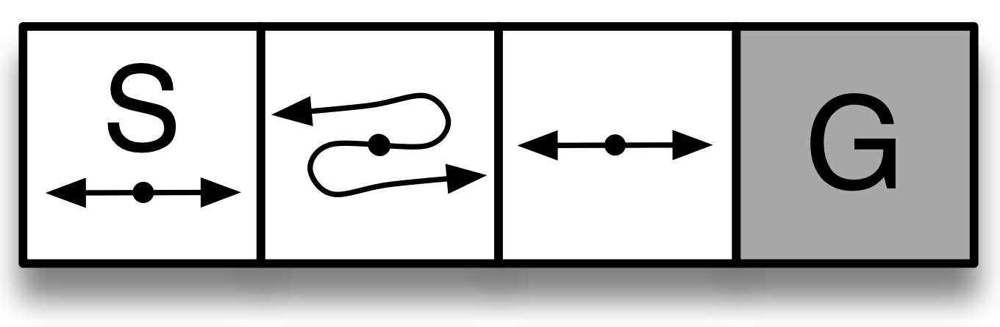
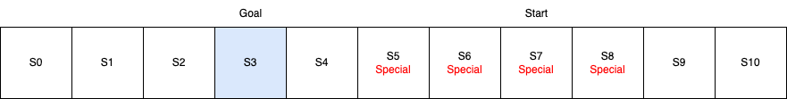
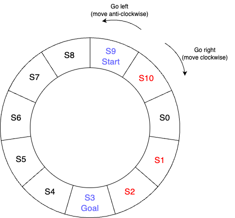
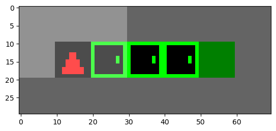
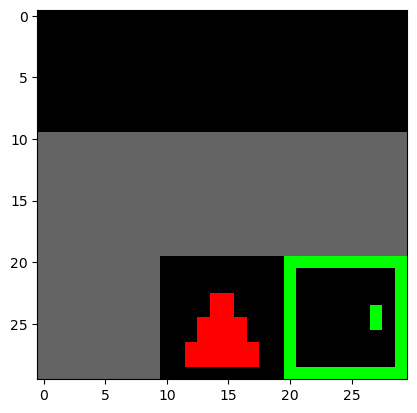

# Corridor-Grid

A set of corridor environments.

A list of environments are registered:

|      ID      |              Type               |
|--------------|---------------------------------|
| CG-SC-v0     | Small Special State Corridor    |
| CG-LC5-v0    | Long Special State Corridor     |
| CG-LC5-S2-v0 | Long Special State Corridor     |
| CG-LC11-v0   | Long Special State Corridor     |
| CG-CC11-v0   | Circular Special State Corridor |
| CG-DC5-v0    | Door Corridor                   |

## Special State Corridor

Special state corridor environment contains states that reverse the action taken
by the agent: in the special state, if the agent takes action left it will
actually move right and vice versa.

The agent can only move left (0) or right (1). 

For the observation, we provide both the wall status (just left and right wall,
since only moveable directions are left and right) as well as the state number
(which will make the environment fully observable).

The reward is -1 per step to encourage shortest path taken.

### Small Special State Corridor

A special state corridor with only 4 states. The agent starts at the end (state
0) and the goal is to reach the other end (state 3). This environment is an
implementation of the environment from Chapter 13.1 (Page 323) in the book: 
Reinforcement Learning An Introduction (second edition) by Richard Sutton and
Andrew Barto.



The default truncate length is 50. After 50 steps, the episode will be
truncated.

### Long Corridor

This extends the small corridor with customisation options. The customisation
should be passed as a `dict` to the constructor. The following options are
supported:

|       Name        |     Type      |        Default        |              Description              |
|-------------------|---------------|-----------------------|---------------------------------------|
| `corridor_length` | `int`         | 4                     | The length of the corridor. Must be >= 2. |
| `start_state`     | `int \| None` | `None`                | The starting state of the agent. If `None` is given in the config, then the environment will randomly choose a starting state at each `reset()`. |
| `goal_state`      | `int`         | `corridor_length - 1` | The goal state of the agent. If `None` is given in the config, then the environment will randomly choose a goal state at each `reset()`. |
| `special_states`  | `list[int]`   | [1]                   | The special states of the environment. |
| `truncate_length` | `int`         | 50                    | The maximum number of steps before the episode is truncated. |

We provide two 3 pre-configured and registered long corridor environments:

|      ID      |                            Config                            |
|--------------|--------------------------------------------------------------|
| CG-LC5-v0    | `{"corridor_length": 5, "start_state": 0}}` |
| CG-LC5-S2-v0 | `{"corridor_length": 5, "start_state": 0, "special_states": [2]}` |
| CG-LC11-v0   | `{"corridor_length": 11, "start_state": 7, "goal_state": 3, "special_states": [5, 6, 7, 8]}` |

Below is a figure of CG-LC11-v0:


### Circular Special State Corridor

This extends the long corridor where the two ends of the corridor are connected.
So there is no end to the corridor, which results in the every state will have
the same wall status of `[0, 0]`. The customisation options are the same as the
long special state corridor.

We provide a pre-configured and registered circular special state corridor:
`CG-CC11-v0`. The config is `{"corridor_length": 11, "start_state": 9,
"goal_state": 3, "special_states": [1, 2, 10]}`. Below is a figure of
`CG-CC11-v0`:



## Minigrid-like Corridor

We simplify the [Key Corridor](https://minigrid.farama.org/environments/minigrid/KeyCorridorEnv/)
from [minigrid](https://minigrid.farama.org/) and create a new environment.

### Door Corridor

This corridor environment contains doors that can be toggled to open or closed.
The agent always start at one end and the goal is to reach the other end. Each
state in between the start and the goal has a door. One pre-configured and
registered environment `CG-DC5-v0` looks like this:



The agent have 4 actions: turn left (0), turn right (1), move forward (2) and
toggle (3). It observes a 3x3 (the view size can be changed) grid view around
itself, like this:



This image observation is encoded as a 3x3x2 tensor, where the last dimension
contains the object number and state status. The objects are:

```
UNSEEN = 0
EMPTY = 1
WALL = 2
DOOR = 3
AGENT = 4
GOAL = 5
```

And the state status are:

```
OPEN = 0
CLOSED = 1
```

The default max steps before truncation is 270.

## Other Notes

You can use `corridor_grid/manual_control.py` to manually play around with the
pre-configured and registered environments.
